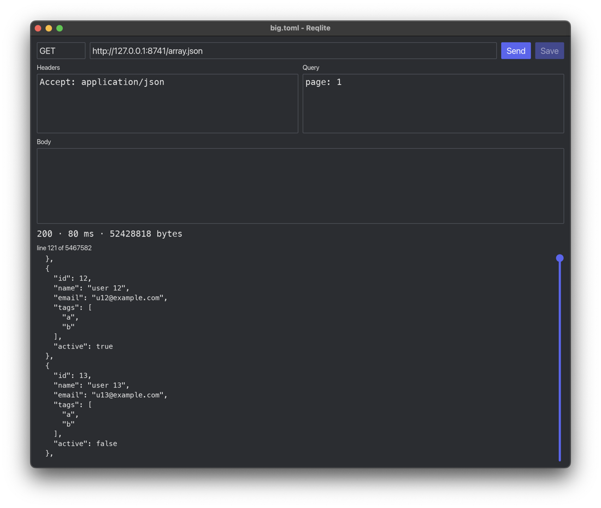

# Reqlite

A lean, local-first API client written in Rust. No account, no cloud, no telemetry.

**Status:** early alpha. The CLI works. The desktop app opens, edits, saves and sends one request file.

## Try it

```sh
cargo run -p reqlite -- send examples/hello.toml        # the CLI
cargo run --release -p reqlite-gui -- examples/hello.toml   # the desktop app
```

### The desktop app

```sh
reqlite-gui users.toml --env envs/dev.toml
```



`reqlite-gui` opens one request file per window. If the file does not exist yet, the first save creates it.

The request is on the left and the response is on the right. Below 900 px of width, the response moves under the request. The request has three tabs, Query, Headers and Body, and each tab shows how many entries it holds. The response shows the status, the time, the size and the body with line numbers. JSON bodies are coloured.

| Action | How |
|---|---|
| Send | Cmd+Enter or Ctrl+Enter, the Send button, or Enter in the URL field |
| Cancel a send | Escape, or the Cancel button |
| Save | Cmd+S or Ctrl+S, or the Save button. Enabled only when the form differs from the file. |
| Go to the URL | Cmd+L or Ctrl+L |
| Switch tabs | Cmd+1, 2, 3 or Ctrl+1, 2, 3 for Query, Headers, Body |
| Scroll the response | Mouse wheel, the scrollbar, Page Up, Page Down, Home, End |

Headers and query parameters are written one per line as `name: value`, and a name may repeat. The title shows `*` while there are unsaved changes; on macOS, a dot next to the file name shows it too. If a file cannot be read, the window shows the error and never saves over that file. Each send is saved to history, the same way as `reqlite send`.

The window is see-through over a blurred desktop where the OS can blur it: on macOS, and on KDE under Wayland. Elsewhere it is opaque. Two environment variables change the look:

| Variable | Effect |
|---|---|
| `REQLITE_GLASS=0` | An opaque window everywhere |
| `REQLITE_REDUCE_MOTION=1` | No animations: every change shows at once |

A request is one TOML file:

```toml
version = 1
name = "Hello"
method = "GET"
url = "https://httpbin.org/get"

[query]
from = "reqlite"
tag = ["a", "b"]   # a name can repeat: ?tag=a&tag=b
```

### Environments

`{{name}}` placeholders in the URL, header values, query values and body come from an environment file:

```toml
# envs/dev.toml (committed)
version = 1
secrets = ["token"]

[vars]
base = "http://localhost:3000"
```

Secret values never go in that file. Put them in `envs/dev.local.toml` next to it. The repo's `.gitignore` already ignores `*.local.toml`.

```toml
# envs/dev.local.toml (not committed)
version = 1

[vars]
token = "..."
```

```sh
reqlite send users.toml --env envs/dev.toml
```

An undefined placeholder stops the send and names the variable.

### cURL import and export

```sh
reqlite import curl "curl 'https://api.example.com/users' -H 'accept: application/json'" -o users.toml
pbpaste | reqlite import curl -o users.toml   # a command copied from the browser
reqlite export curl users.toml
```

Import never drops an option silently. Anything it cannot map prints a warning, for example `-k`, a body read from `@file`, or credentials given with `-u`, which are not written to a file you might commit. A header that holds a literal token also gets a warning, so you can move the token to a secret. Import refuses to replace an existing file unless you pass `--force`.

### Postman import

```sh
reqlite import postman Shop.postman_collection.json -o shop/
```

Each folder becomes a directory and each request a file. `{{placeholders}}` carry over unchanged. Auth set on a folder or the collection is copied into each request that inherits it. Reqlite runs no scripts, so every pre-request and test script prints a warning that names its request. Disabled headers and parameters, form-data bodies, saved example responses and collection variables also print warnings.

### History

Each send is saved to a local history file, `history.db` in your data directory (for example `~/Library/Application Support/reqlite` on macOS). Set `REQLITE_DATA_DIR` to put it somewhere else. History never leaves your machine and is never committed. Secret values are replaced with `{{name}}` before anything is saved, including in response bodies and headers that echo them. History keeps the first 256 KiB of each response body.

```sh
reqlite history -n 10
```

If the history file is damaged, Reqlite moves it aside as `history.db.corrupt-<time>`, starts a new one, and says so. A history problem never stops a send.

### Timeouts

Every send has limits, so a server that never answers cannot hang Reqlite:

| Limit | Default | What it covers |
|---|---|---|
| Connect | 10 s | Opening the connection, including TLS |
| No data | 30 s | The wait for the next bytes, headers or body. It resets on every read, so a large download that keeps moving never reaches it. |
| Total | none | The whole send. Set it with `--timeout SECS`. |

```sh
reqlite send slow.toml --timeout 5
```

A send that passes a limit exits with code 1, and the message names the limits that applied.

### Exit codes

| Code | Meaning |
|---|---|
| 0 | The request completed, whatever the HTTP status |
| 1 | The request did not complete (connect, timeout, transport) |
| 2 | Wrong command-line usage |
| 3 | A request or environment file is unreadable or invalid, or a placeholder has no value |

## Layout

| Crate | Job |
|---|---|
| `crates/format` | Request and environment file formats: schema, parser, writer |
| `crates/engine` | Resolves placeholders, sends a request, returns the response. No UI code. |
| `crates/store` | Local request history in SQLite |
| `crates/import` | cURL import and export, Postman import |
| `crates/gui` | The `reqlite-gui` desktop app (iced) |
| `crates/cli` | The `reqlite` command |

Design rules:

1. Request files are the source of truth. History lives in a local SQLite file. It is your data, so no rebuild or reset ever deletes it.
2. The engine is headless. The CLI and the future GUI are thin clients over it.
3. No login and no server in v1.

## Resource budgets

| Metric | Budget | Now (macOS, M4) | Checked in CI |
|---|---|---|---|
| GUI idle footprint, 1000×800 window on a 2× display | under 60 MB | 58 MB | locally (`scripts/gui_idle.py`); CI runners have no 2× display |
| GUI idle footprint minus window frame buffers, any display | under 35 MB | 33 MB | yes, macOS |
| GUI idle CPU, over 5 s | under 0.05 s | 0.00 s | yes, macOS |
| Binary | under 25 MB | CLI 3.7 MB, GUI 8.2 MB | yes |
| Cold start | under 300 ms | CLI 3 ms, GUI first frame 97 ms | CLI yes; GUI locally, because CI runners have no real GPU |
| Peak RAM while opening a 50 MB JSON response | under 50 MB | viewer 1.8 to 2.5 MB, CLI send 9.3 MB | yes |

The GUI rows use the physical footprint, which Activity Monitor shows as "Memory". The window's frame buffers grow with the window size and the display scale, so the first GUI row fixes both. The second row counts only the memory Reqlite controls. See [issue #1](https://github.com/officialaritro/reqlite/issues/1) for the measurements behind these numbers. `scripts/gui_idle.py target/release/reqlite-gui` checks both, plus idle CPU and the GUI cold start, on macOS. CI runs it on macOS. CI runners are virtual machines with a 1× display and no real GPU, so there it checks only the memory Reqlite controls and prints the other two numbers.

`scripts/budgets.py` runs the other checks on Linux and macOS in CI and fails the build on a miss. It also checks that each crate depends only on the crates below it. To run it yourself:

```sh
python3 scripts/budgets.py
```

The script builds the release binaries and examples first, so it never measures a stale build.

## License

Licensed under either of [Apache License, Version 2.0](LICENSE-APACHE) or [MIT license](LICENSE-MIT), at your option.

Unless you explicitly state otherwise, any contribution intentionally submitted for inclusion in this project by you, as defined in the Apache-2.0 license, shall be dual licensed as above, without any additional terms or conditions.
